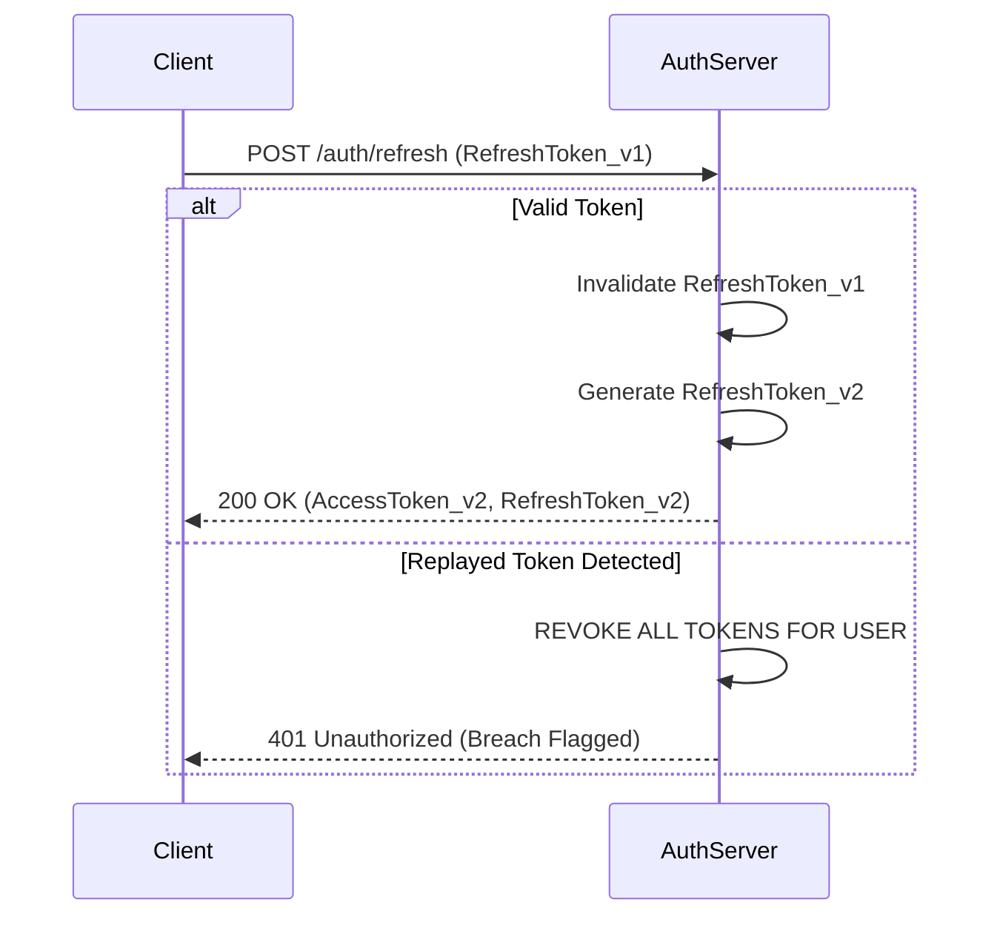

# authentication

## Core Philosophy
Authentication is security engineering, not a weekend feature to hack together. Rolling custom cryptographic functions or hashing passwords with naive SHA-256 is an immediate vulnerability. Production authentication requires industry-standard protocols (OAuth 2.0, OIDC, WebAuthn), cryptographically secure password hashing (Argon2id), stateful session management or rotated short-lived JWTs, and multi-factor authentication (MFA) with replay attack protection.

---

## 4-Step Authentication Architecture Framework

### Step 1: Password Storage & Cryptographic Hashing
1. **The Argon2id Standard**:
   - Never use MD5, SHA-1, SHA-256, or plain bcrypt for new systems. Enforce **Argon2id** (RFC 9106):
     - Memory Cost ($m$): minimum 64MB (65536 KiB).
     - Time Cost ($t$): minimum 3 iterations.
     - Parallelism ($p$): 4 threads.
     - Salt: 16 cryptographically secure random bytes generated per password (`crypto.randomBytes(16)`).
2. **Password Policies**:
   - Enforce minimum length (>= 12 characters). Prohibit arbitrary character restrictions that prevent password managers from generating high-entropy strings.
   - Screen passwords against haveibeenpwned k-anonymity hash API during registration.

### Step 2: Session Management & Token Lifecycles
1. **Cookie-Based Sessions vs Stateless JWTs**:
   - *Stateful Sessions (Preferred for Web Apps)*: Store session ID in an `HttpOnly; Secure; SameSite=Lax` cookie. Back with Redis/PostgreSQL for instant revocation.
   - *Stateless JWTs (API / Mobile)*:
     - Access Token TTL: Strictly 10 to 15 minutes. Sign with asymmetric keys (RS256 or Ed25519), never symmetric HS256 with weak secrets.
     - Refresh Token TTL: 14 to 30 days. Store hashed in database.
2. **Refresh Token Rotation & Reuse Detection**:
   - Issue a single-use refresh token. When exchanged, issue a new access token and invalidate the old refresh token.
   - If an invalidated refresh token is ever presented, invalidate the entire token family immediately—this indicates token theft.

### Step 3: OAuth 2.0 & OpenID Connect (OIDC) with PKCE
1. **Authorization Code Flow with PKCE**:
   - Proof Key for Code Exchange (PKCE, RFC 7636) is mandatory for all clients (SPAs, mobile apps, and server-side apps).
   - Generate high-entropy `code_verifier` and compute `code_challenge = BASE64URL-ENCODE(SHA256(code_verifier))`.
   - Validate cryptographically random `state` parameter on callback to prevent Cross-Site Request Forgery (CSRF).

### Step 4: Multi-Factor Authentication (MFA) & Passkeys
1. **TOTP (RFC 6238)**:
   - Secret key minimum 160 bits (32 base32 characters).
   - Time step: 30 seconds; clock skew allowance: $\pm 1$ step.
   - Generate 8 single-use emergency backup recovery codes, hashed with Argon2id.
2. **WebAuthn / Passkeys (FIDO2)**:
   - Implement biometric passkeys as primary or secondary auth, binding authentication to the physical hardware authenticator and origin domain.

---

## Deliverable Format: Authentication Architecture Spec (`AUTH-SPEC.md`)

```markdown
# Authentication System Specification: [Application Name]

## 1. Credentials & Cryptography Baseline
- **Password Hash**: Argon2id ($m=65536, t=3, p=4$, salt=16 bytes)
- **Session Mechanism**: Stateful HttpOnly Cookies / Ephemeral JWT
- **JWT Signing Algorithm**: RS256 (Public/Private keypair via KMS)
- **Token Lifetimes**: Access Token = 15 mins | Refresh Token = 14 days

## 2. Token Exchange & Rotation Sequence


## 3. Cookie Security Attributes
```http
Set-Cookie: __Host-session_id=s%3A8f...; Path=/; Secure; HttpOnly; SameSite=Lax; Max-Age=1209600
```
```

---

## Worked Example: Zero-Downtime Session Invalidation

- **Challenge**: User reported stolen laptop; needed immediate revocation across all active sessions while keeping other team members logged in.
- **Implementation**: Redis-backed session store keyed by `user_sessions:{user_id}:{session_id}`. Revoked all keys matching prefix on password reset.
- **Result**: Immediate revocation of active sessions within 5ms globally; zero orphaned tokens.

---

## Verification Checklist

- [ ] Passwords hashed using Argon2id with recommended memory and time parameters.
- [ ] Cookies configure `HttpOnly`, `Secure`, and `SameSite` flags.
- [ ] Refresh tokens use rotation and detect reuse to trigger family revocation.
- [ ] OAuth 2.0 flows implement PKCE and validate the `state` parameter against CSRF.
- [ ] Rate-limiting is enforced on all login, reset, and token endpoints (max 5 attempts/min).

---

## Anti-Patterns

- **Rolling Your Own Crypto**: Writing custom encryption or hashing algorithms.
- **Storing JWTs in LocalStorage**: Exposing tokens to XSS script injection attacks.
- **Permanent Access Tokens**: Issuing JWTs with 30-day expiration and zero revocation mechanism.
