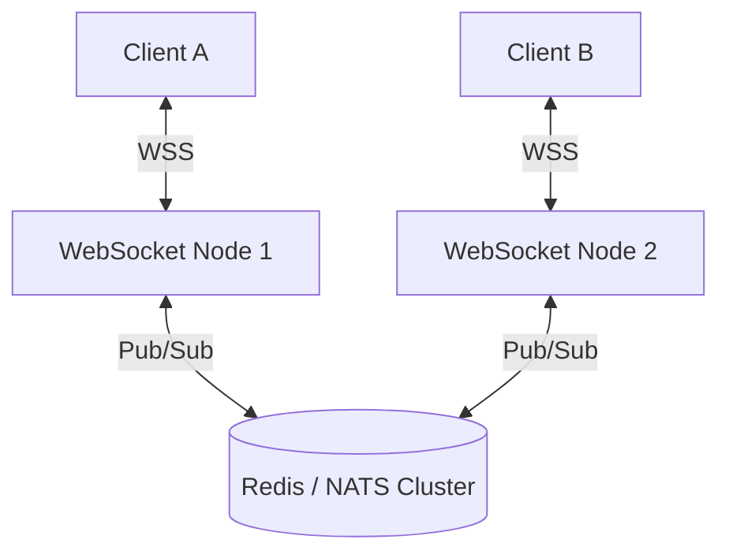

# realtime-systems

## Core Philosophy
Realtime systems are not simply regular HTTP request-response APIs wrapped in an infinite polling loop. True realtime architectures maintain persistent bidirectional or streaming connections (WebSockets, Server-Sent Events, gRPC streaming) governed by connection lifecycle management, heartbeat health checks, exponential backoff reconnection, horizontal pub/sub fanout, and strict backpressure handling to prevent server memory exhaustion.

---

## 4-Step Realtime Architecture Framework

### Step 1: Protocol Selection Matrix
1. **WebSockets vs Server-Sent Events (SSE) vs WebTransport**:
   - *Server-Sent Events (SSE)*: Best for unidirectional server-to-client streaming (LLM token generation, live stock feeds, notification feeds). Operates over standard HTTP/2, automatic reconnection, simple browser native API (`EventSource`).
   - *WebSockets (WS/WSS)*: Mandatory for low-latency bidirectional communication (collaborative editors, multiplayer games, interactive chat).
   - *WebTransport / UDP*: Extreme low-latency audio/video streaming and gaming.

### Step 2: Connection Lifecycle & Heartbeat Management
1. **Ping/Pong Heartbeat Protocol**:
   - Fire server-side ping every 30 seconds:
     ```javascript
     ws.ping(); // Expect pong response within 5 seconds
     ```
   - If 2 consecutive pongs are missed, terminate socket (`ws.terminate()`) to prevent ghost/zombie connection accumulation.
2. **Client Reconnection with Jitter**:
   - Never reconnect with fixed intervals (avoids the "thundering herd" problem when servers restart).
   - Enforce Exponential Backoff with Jitter:
     $$T_{text{wait}} = \min(T_{text{max}}, T_{text{base}}  imes 2^{text{attempt}}) \pm text{random_jitter}$$

### Step 3: Horizontal Scaling & Pub/Sub Fanout
1. **The Single-Node Bottleneck**:
   - Sockets are stateful connections pinned to a single server process.
2. **Redis / NATS Pub/Sub Message Bus**:
   - Decouple connection management from message broadcasting.
   - When User A sends a message on Server 1:
     - Server 1 publishes event to Redis channel `room:123`.
     - Servers 2, 3, and 4 subscribe to `room:123` and broadcast the message to their locally connected sockets.

### Step 4: Backpressure & Buffer Defense
1. **Client Slow-Consumer Protection**:
   - If a client connection throttles (e.g. mobile device in tunnel), the server output buffer will swell, leading to Out-Of-Memory (OOM) crashes.
2. **Backpressure Controls**:
   - Monitor socket buffer size (`ws.bufferedAmount`). If buffer exceeds 1MB, drop ephemeral messages (e.g. cursor positions) or pause ingestion until buffer drains.

---

## Deliverable Format: Realtime Architecture Spec (`REALTIME-SPEC.md`)

```markdown
# Realtime Communication System Specification: [Feature Name]

## 1. Protocol & Infrastructure Architecture
- **Selected Protocol**: WebSockets (`wss://`) / Server-Sent Events (`text/event-stream`)
- **Transport Security**: TLS 1.3 enforced
- **Pub/Sub Broker**: Redis Cluster / NATS Core
- **Target Concurrency**: 50,000 simultaneous active connections

## 2. Horizontal Fanout Topology


## 3. Resilience & Heartbeat Specs
- **Heartbeat Interval**: Ping every 30s | Pong timeout: 5s
- **Client Backoff**: Base: 500ms, Max: 30s, Jitter: $\pm 20\%$
- **Slow Consumer Policy**: Disconnect socket if `bufferedAmount` > 2MB for 10s.

## 4. Message Framing Schema
```json
{
  "event": "room:message",
  "room_id": "c1248",
  "sender_id": "usr_99",
  "sequence_id": 14208,
  "payload": {
    "text": "Hello world"
  }
}
```
```

---

## Worked Example: Collaborative Document Presence Engine

- **Challenge**: 1,000 engineers viewing the same document generated 1,000,000 cursor updates per minute, crashing Node.js servers.
- **Solution**:
  - Downsampled cursor broadcasts from 60Hz to 15Hz client-side.
  - Implemented backpressure checking on socket buffer before pushing.
  - Switched from JSON strings to compact binary Protobuf payloads.
- **Outcome**: Server CPU dropped by 72%; memory usage stabilized under 300MB at 25,000 active connections.

---

## Verification Checklist

- [ ] Ping/pong heartbeat terminates dead connections within 35 seconds.
- [ ] Client reconnection implements exponential backoff with randomized jitter.
- [ ] Horizontal scaling is backed by Redis or NATS pub/sub message broker.
- [ ] Backpressure safeguards drop or throttle messages when client buffers overflow.
- [ ] Connections operate strictly over encrypted protocols (`wss://` or HTTPS).

---

## Anti-Patterns

- **Short-Polling pretending to be Realtime**: Hitting an API endpoint every 500ms from the browser.
- **Memory Leaks from Event Listeners**: Forgetting to remove event listeners on socket disconnect, crashing the Node.js process.
- **Broadcasting Everything to Everyone**: Sending all global events to all connected clients and filtering on the frontend.
